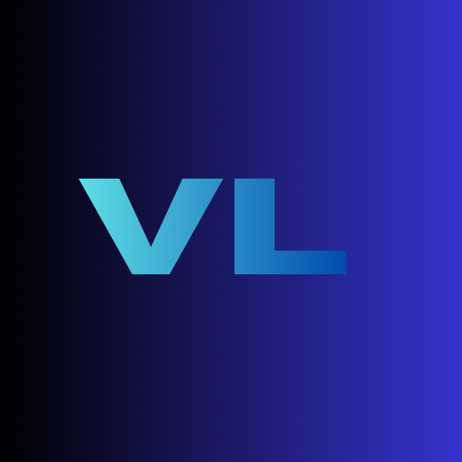

# Volume Limit 🎧

A lightweight, efficient Android utility designed to enforce a maximum media volume limit, ensuring a consistent and safe auditory experience.

This project is **100% vibecoded**—built entirely through interactive AI-assisted development to solve a real-world problem with speed and precision.

## Project Origin
This application was developed as a practical solution for a common household challenge. The primary motivation was a young family member (my little sister) whose enthusiastic consumption of short-form content like YouTube Shorts frequently involved maximum volume levels. 

To preserve the peace at home and protect her hearing, I directed the development of this tool to enforce a system-level volume cap. It was originally built for my parents to ensure a managed auditory environment without manual intervention.

By enforcing a hard limit, the app protects both the user's hearing and the device's hardware from prolonged exposure to maximum volume.

## Features
- **Deterministic Volume Control**: Dynamically intercepts and corrects any attempt to exceed the user-defined volume threshold.
- **Resource Optimized**: Built using an event-driven `ContentObserver` architecture. The service remains in a low-power state, activating only when a system volume change is detected.
- **Persistent Foreground Service**: Utilizes a low-priority notification to maintain service integrity without cluttering the user's active notification space.
- **Battery Optimization Compatibility**: Includes built-in logic to request battery optimization exemptions, ensuring 100% reliability on aggressive power-management systems (e.g., Android 14/15).
- **Localized Interface**: Full support for **English** and **Arabic** (RTL), automatically adapting to the system locale.
- **Modern Material 3 UI**: Clean interface with smooth, scale-based feedback on interactive elements.

## Open Source Standards
The codebase is structured for transparency and ease of audit:
- **Zero Dependencies on Proprietary Blobs**: All assets and icons are locally hosted and optimized.
- **Privacy-First**: No telemetry, no analytics, and no network permissions required.
- **Standard Toolchain**: Uses the latest Gradle/Kotlin DSL standards for reproducible builds.

## License & Permissions
This project is licensed under the **MIT License**. 

You are free to copy, modify, and distribute the software as you wish ("copy it and shit"). However, you **must** provide attribution to the original author (**lilstrawbrry14**) in any copies or substantial portions of the software.

## Support the Developer
If you find this utility helpful and want to support more vibecoded projects, feel free to drop some LTC here:

**LTC Address:** `YOUR_LTC_WALLET_ADDRESS_HERE`

## Credits
- **Developed by Gemini CLI (using the Gemini 3 model)** for the project owner **lilstrawbrry14**.
- Conceived and directed by **lilstrawbrry14**.

---
*This README was written by Gemini.*
